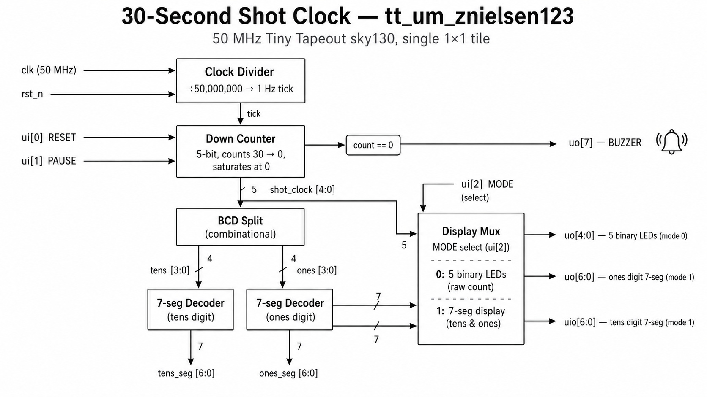
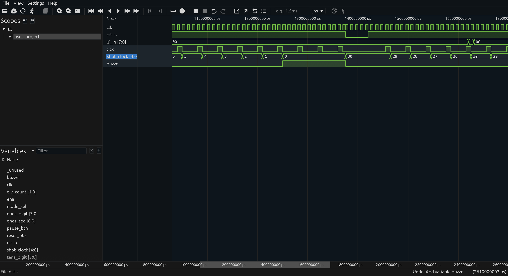
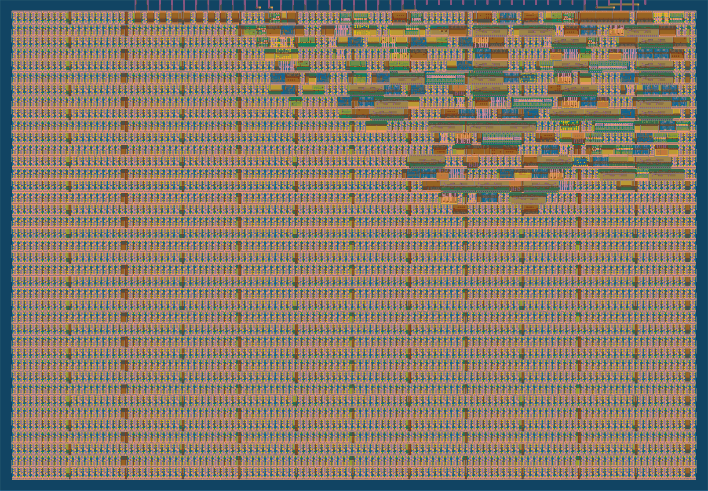

<!---
This file is used to generate the project datasheet for tinytapeout.com.
-->

## How it works

This project is a **30-second basketball shot clock**. It counts down once per
second from 30 to 0, lights a buzzer LED when it reaches zero, and supports
reset and pause inputs. The current value can be read out on the chip pins in
two different ways, selectable with a mode switch.

Internally the design is four small blocks:

1. **Clock divider.** The 50 MHz `clk` is divided down to a 1 Hz tick by a
   26-bit counter. Every 50,000,000 cycles, a one-cycle `tick` pulse fires.
2. **Down counter.** A 5-bit register holds the current shot-clock value. On
   each `tick`, the counter decrements by 1 unless it is already 0 (the count
   saturates rather than wrapping around). The counter reloads to 30 when the
   reset button is pressed.
3. **BCD split.** A combinational block splits the current count (0–30) into
   a tens digit (0–3) and a ones digit (0–9) for the 7-segment outputs.
4. **Output mux.** A mode-select bit picks between routing the raw 5-bit
   count to LEDs or routing the two 7-segment encodings to the segment pins.

The reset (`ui[0]`) and pause (`ui[1]`) inputs are sampled synchronously.
Pause holds the count at its current value but does **not** stop the internal
clock divider, so resuming continues on the original 1-second cadence (no way
to game the timing by bouncing the pause switch).

## How to test

The design has two display modes. Pick one based on what external hardware
you have available, then drive the inputs:

- **Mode 0 — Binary on 5 LEDs (`ui[2] = 0`).** Connect 5 LEDs to
  `uo[4:0]`. They show the current count in binary. Connect one more LED to
  `uo[7]` — this is the buzzer indicator that lights when the count hits 0.
- **Mode 1 — Dual 7-segment (`ui[2] = 1`).** Connect a common-cathode
  7-segment digit to `uo[6:0]` (ones digit) and another to `uio[6:0]`
  (tens digit). The buzzer LED stays on `uo[7]`.

Then:

1. Apply power. The count resets to 30 automatically when `rst_n` is held
   low (Tiny Tapeout pulses this on startup).
2. Release `rst_n`. The count starts ticking down at 1 Hz.
3. Press `ui[0]` (reset button) at any time to reload to 30.
4. Hold `ui[1]` (pause) high to freeze the count.
5. When the count reaches 0, the buzzer LED on `uo[7]` lights and stays on
   until the next reset.

A simulation waveform showing the first few ticks of a countdown in mode 0:

And the rendered sky130 layout:

## External hardware

- 5 LEDs (with current-limiting resistors) for the binary mode.
- 2 common-cathode 7-segment displays (with per-segment current-limiting
  resistors) for the 7-segment mode. Wire segment `a` to `uo[0]` / `uio[0]`,
  `b` to `uo[1]` / `uio[1]`, and so on through `g` on bit 6.
- 1 LED for the buzzer indicator on `uo[7]`.
- Two pushbuttons (one tied to `ui[0]` for reset, one tied to `ui[1]` for
  pause), and a SPDT switch on `ui[2]` to select display mode.
